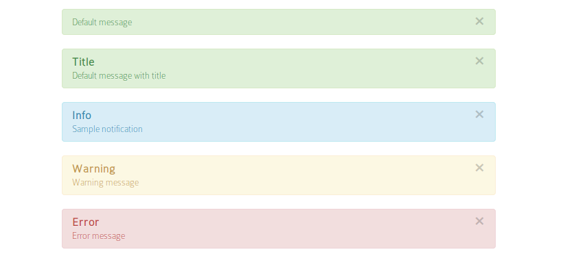

====================
Flash messages HOWTO
====================

Configuration:
--------------
To configure default template
Beech:
  Ehrm:
    viewHelpers:
      partialRootPath: 'resource://Beech.Ehrm/Private/Templates/ViewHelpers/Partials/'
      templates:
        'Beech\Ehrm\ViewHelpers\FlashMessagesViewHelper': 'resource://Beech.Ehrm/Private/Templates/ViewHelpers/FlashMessages.html'

Usage (in controller):
--------------------
  $this->addFlashMessage('Default message');
  $this->addFlashMessage('Default message with title', 'Title');
  $this->addFlashMessage('Sample notification', 'Info', \TYPO3\Flow\Error\Message::SEVERITY_NOTICE);
  $this->addFlashMessage('Warning message', 'Warning', \TYPO3\Flow\Error\Message::SEVERITY_WARNING);
  $this->addFlashMessage('Error message', 'Error', \TYPO3\Flow\Error\Message::SEVERITY_ERROR);

Usage (in template):
------
To use it, add namespace to template:
{namespace ehrm=Beech\Ehrm\ViewHelpers}

And then:
<ehrm:flashMessages/>

Screenshots
-----------

